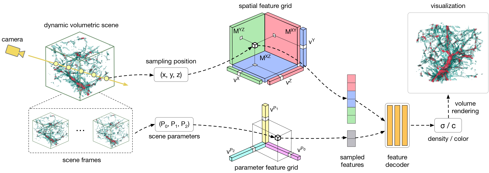

# ViSNeRF: Efficient Multidimensional Neural Radiance Field Representation for Visualization Synthesis of Dynamic Volumetric Scenes

### [arXiv Paper](https://arxiv.org/abs/2502.16731)



## Installation
Clone this repository using the following command:
```
git clone https://github.com/JCBreath/ViSNeRF
cd ViSNeRF
```

The conda environment for ViSNeRF. Install the dependencies and activate the environment `visnerf` with
```
conda create -n visnerf python=3.8
conda activate visnerf
conda install -c nvidia/label/cuda-11.6.2 cuda-toolkit
python -m pip install -r requirements.txt
```

## Training
To run ViSNeRF, here’s an example using the Nyx dataset:
```
python train.py --config configs/nyx_vol.txt
```

## Data Convention
ViSNeRF uses a customized NeRF Blender format for dynamic scenes, similar to [D-NeRF](https://github.com/albertpumarola/D-NeRF). 
However, instead of using `time` to specify scene frames, ViSNeRF uses `params`. 
For more details, refer to the Nyx dataset.
